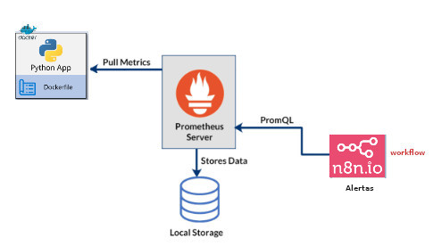
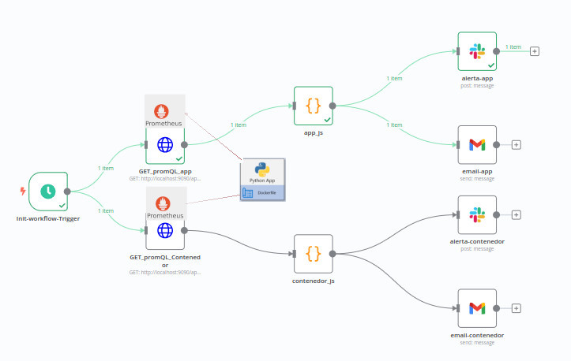

# SAMI : Sistema Automatizado de Monitoreo de Infraestructuras

## Arquitectura SAMI

- 

## Workflow Alertas
- 

## Indicaciones 
En cada directorio hay un README.md que permite crear los contenedores.
- prinero leer /contenedores-conf/
- segundo leer /n8n/
- tercero leer /metricas/

**Sigueiente** -> Leer READEM en "contenedores-config/READEM.md"
